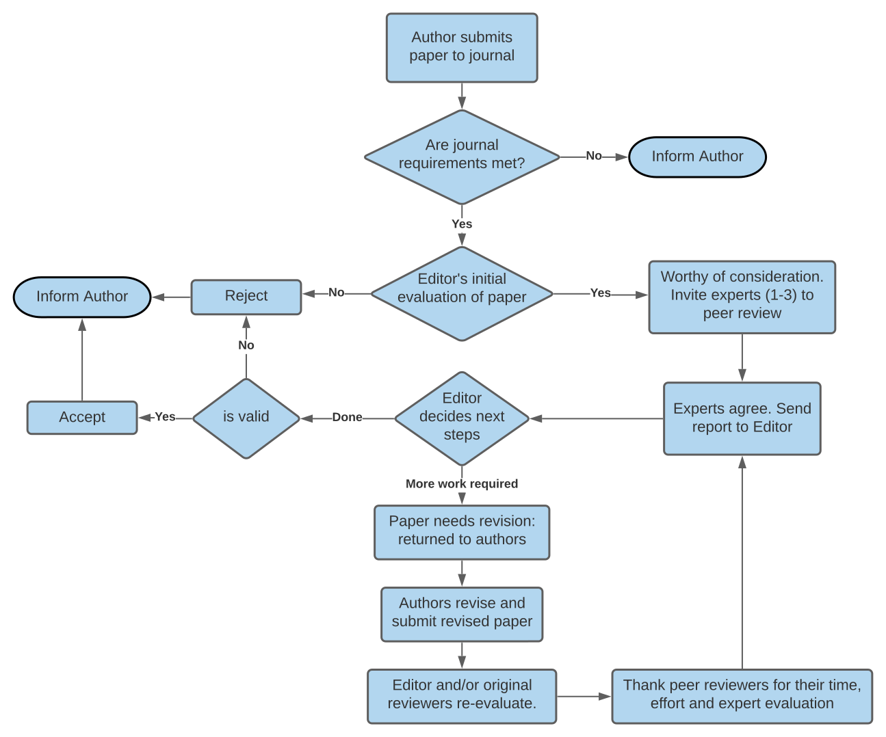
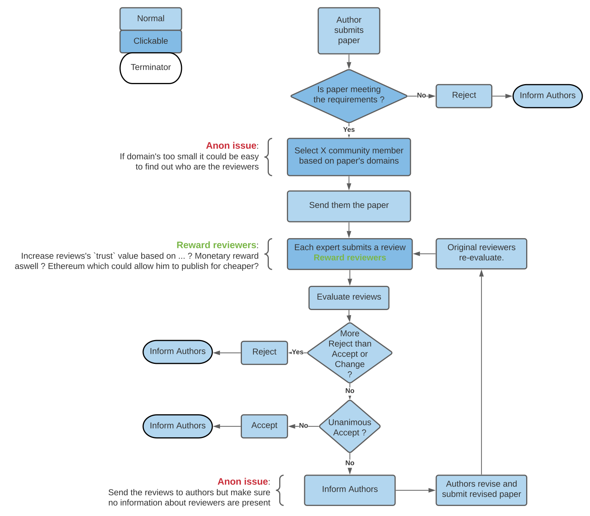

# ResearchShare

## Table of Content

- [Introduction](#introduction)
- [Stack](#stack)
- [Design](#design)  
- [Roadmap & Contributors](#roadmap--contributors)
  - [First Iteration](#first-iteration)
  - [Second Iteration](#second-iteration)  

## Introduction

ResearchShare is a platform where you can publish research papers for free.
It uses [IPFS](https://ipfs.io/) & [Ethereum](https://ethereum.org/en/) [smart contracts](https://ethereum.org/en/developers/docs/smart-contracts/)
to store and validate the papers.

You can find the motives [here](./doc/Motives.md). One of them is to be transparent therefore 
you can find a very extensive doc about the processes, implementations, ..., [here](./doc).

It is currently going under it's [second iteration](#second-iteration). We aim to push this project much further
than a simple PoC.

## Stack

  - [IPFS](https://ipfs.io/) is used to store the research papers as a mean to decentralize the information.
  - [Ethereum](https://ethereum.org/en/) & [Solidity](https://soliditylang.org/) are used as backend. It allows us to
    run our logic in a resilient & trustless environment. However due to the current state of Ethereum 
    ([*v2 is underway*](https://consensys.net/blog/blockchain-explained/what-is-ethereum-2/), huge gas fees, ...) the 
    project may switch to another protocol in the future.
  - [ReactJS](https://reactjs.org/) is used for the front.
  - [TruffleSuite](https://www.trufflesuite.com/ganache) is used to tests our contracts.
  - [Docker](https://www.docker.com/) is used to deploy the platform via [compose](https://docs.docker.com/compose/)

## Design

Before diving into the design, it is important to remember that the project is still a PoC. The design isn't set in stone
and is very likely going to change, get more detailed, through time. You can find more details in the [doc](./doc) folder.

Because the platform aims to be an alternative to well known editors, we tried to reproduce and adapt one of their process
to treat the submission of a paper. The following diagram is made from information we gathered and describes the big picture
of what happens to a submitted paper.

And here's our version.

As you can see, they are similar. However it is important that we can't fully reproduce the editor's process as it can be hard,
especially for a PoC, to describe them in terms of code. For further details, including information about the "clickable"
elements of the diagram, be sure to checkout [this document](./doc/SubmitProcess.md).

## Roadmap & Contributors

In this section, you'll find what each iteration brought to the project as well as their contributors.
While the contributors changes, the project remains under the supervision of [Luca George-François](https://github.com/PtitLuca),
who had the idea of the project, is the junior VP and manages the P2P projects within [PoC](https://www.poc-innovation.fr/).

### First Iteration
It took place from September 2020 to March 2021, a first team focused on the following points:

  - [x] [Draft of the process to submit a paper](./doc/SubmitProcess.md).
  - [x] [Draft of the Contracts](./doc/ContractsDiagrams).
  - [x] Upload a file to IPFS & save its hash via the contracts.
  - [x] Begin the implementations of the contracts.
    - [x] User registration (linked the to the contracts).
    - [x] Submit/retrieve a paper.
    - [x] Find reviewers (best algorithm out there: random.
    - [x] Submit a review.
  - [x] Very basic front proving components for the features we implemented

**Contributors**:
  - [Alexandre Chetrit](https://github.com/chetrit)
  - [Matthis Cusin](https://github.com/Basilarc)
  - [Quentin Veyrenc](https://github.com/VrncQuentin)

### Second Iteration
While the 1st iteration got the foundations laid, they still need some work done which is why,
from mid March to the end of August 2021, a new team will aim to do the following:

  - [ ] Define a proper way to select Reviewers for a paper & implement it.
  - [ ] Improve the submission process.
  - [ ] Improve users management.
  - [ ] Possibly, improve the way we use IPFS.
  - [ ] Possibly, improve the front.

**Contributors**:
 - [Lucie Philippon](https://github.com/Ersikan)
 - [Alexandre Monier](https://github.com/ThalusA)
 - [Adina C.]()